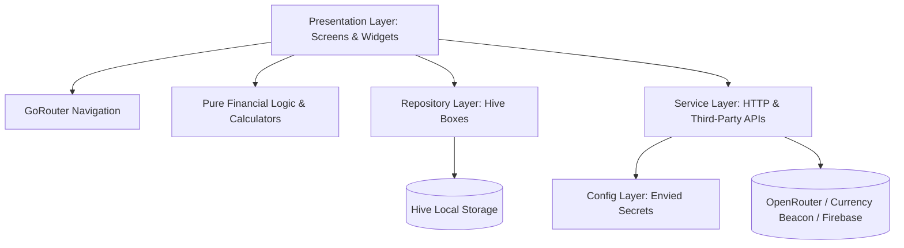

# MortgageLoan — AI Agent & Developer Architecture Guide

Welcome to the **MortgageLoan** codebase. This document serves as the master context and technical reference for AI coding agents and human engineers working on this project. It outlines the project's identity, modern architecture, directory structure, data layers, external integrations, security practices, and operational rules.

---

## 1. Project Identity & Vision

**MortgageLoan** is a comprehensive, production-grade Flutter financial calculator and smart advisory application. It empowers users to make informed lending and investment decisions through accurate calculations, scenario simulations, real-time market data, and AI-driven financial recommendations.

### Core Capabilities
* **Mortgage & Loan Calculator**: Instant calculation of monthly payments, total interest, and full amortization schedules.
* **Loan Simulator & Advanced Scenarios**: Comparison of loan types (Mortgage, Vehicle, Personal) with lump-sum pre-payments and recurring extra monthly payments to evaluate interest savings and tenure reduction.
* **Compound Interest Calculator**: Multi-year compound growth projections with dynamic interactive charts (`fl_chart`) and year-by-year breakdowns.
* **Live Currency Converter**: Real-time multi-currency conversions and historical exchange rate trends powered by Currency Beacon API.
* **AI Financial Insights & Advisory**: Tailored financial strategies, regional bank comparisons, refinancing opportunities, and negotiation recommendations generated via OpenRouter AI.
* **Local History & Data Sync**: Secure offline storage of calculation history and AI analyses via Hive.

---

## 2. Technology Stack & Tooling

| Component | Technology / Library | Version / Scope |
| :--- | :--- | :--- |
| **Framework** | Flutter (Dart SDK `>=3.0.0 <4.0.0`) | Multi-platform mobile (iOS & Android) |
| **Routing** | `go_router` | Declarative routing (`MaterialApp.router`) |
| **Local Storage** | `hive` & `hive_flutter` | Lightweight NoSQL key-value & document storage |
| **Secrets Security** | `envied` & `envied_generator` | Compile-time encrypted & obfuscated secrets |
| **Charts & Visuals** | `fl_chart` | Interactive charts for growth & exchange trends |
| **Analytics & Stability**| `firebase_core`, `firebase_analytics`, `firebase_crashlytics` | Telemetry, event logging, and crash monitoring |
| **Monetization** | `google_mobile_ads` | Non-intrusive banner and interstitial ads |
| **App Updates** | `upgrader` | Store version check and upgrade prompt |
| **Networking** | `http` | REST client with in-memory caching |
| **Code Generation** | `build_runner` | Generator runner for `envied` |
| **Static Analysis** | `flutter_lints` | Strict static analysis (`strict-casts`, `strict-inference`) |

---

## 3. System Architecture & Design Principles

The application follows a clean, modular, layered architecture adhering to SOLID principles:



### Architectural Principles
1. **Separation of Concerns**: Presentation widgets are decoupled from raw calculation formulas and data storage details.
2. **Pure Financial Calculators**: All mathematics (loan payments, amortization, compound growth, extra payment savings) are pure Dart static utilities located in `lib/src/utils/`. These functions have zero dependencies on Flutter UI elements, making them deterministic and 100% unit-testable.
3. **Repository Pattern for Persistence**: Hive storage operations are encapsulated into domain-specific repository classes (`LoanRepository`, `CompoundInterestRepository`, `AiAnalysisRepository`, `AdRepository`, `AppDataRepository`).
4. **Compile-Time Obfuscated Configuration**: API keys and environment variables are strictly managed through `Env` backed by `envied`. No plain `.env` files are bundled in asset bundles.

---

## 4. Directory & File Structure

```
mortgageloan/
├── .env.example                       # Template for environment variables
├── analysis_options.yaml              # Strict static analysis configuration
├── pubspec.yaml                       # App dependencies and configuration
├── lib/
│   ├── main.dart                      # App entry point, Firebase/Hive/AdMob init, MaterialApp.router
│   ├── firebase_options.dart          # Firebase configuration
│   └── src/
│       ├── config/
│       │   ├── env.dart               # Envied definition (obfuscated compile-time secrets)
│       │   └── env.g.dart             # Generated obfuscated code (gitignored)
│       ├── database/                  # Hive Repositories (Domain Data Access)
│       │   ├── ad_repository.dart
│       │   ├── ai_analysis_repository.dart
│       │   ├── app_data_repository.dart
│       │   ├── compound_interest_repository.dart
│       │   └── loan_repository.dart
│       ├── models/                    # Data Transfer Objects & Domain Models
│       │   ├── ai_analysis_model.dart
│       │   ├── compound_interest_model.dart
│       │   ├── country_model.dart
│       │   └── loan_model.dart
│       ├── router/                    # Declarative GoRouter configuration
│       │   └── routes.dart            # Route definitions and AppRoutes constants
│       ├── screens/                   # UI Screens
│       │   ├── ai_insights_page.dart
│       │   ├── amortization_page.dart
│       │   ├── compound_breakdown_page.dart
│       │   ├── compound_interest_page.dart
│       │   ├── currencyconvert_page.dart
│       │   ├── history_page.dart
│       │   ├── home_page.dart
│       │   └── loan_simulator_page.dart
│       ├── services/                  # External Network & Utility Services
│       │   ├── analytics_service.dart # Firebase Analytics helper
│       │   ├── cache_service.dart     # In-memory TTL cache
│       │   ├── currency_service.dart  # Currency Beacon API client
│       │   └── openrouter_service.dart# OpenRouter AI Chat Completion client
│       ├── utils/                     # Pure Calculation Utilities & Helpers
│       │   ├── ad_helper.dart         # AdMob Unit IDs resolver
│       │   ├── compound_interest_calculator.dart
│       │   ├── currency_input_formatter.dart
│       │   ├── interstitial_ad_helper.dart
│       │   ├── loan_calculator.dart
│       │   └── loan_simulation_calculator.dart
│       └── widgets/                   # Reusable UI Components
│           ├── adbanner_widget.dart
│           ├── custom_slider.dart     # Custom thumb and track slider styling
│           └── drawer_widget.dart     # Navigation drawer with version tag
└── test/                              # Automated Unit & Widget Tests
    ├── models/
    │   ├── compound_interest_model_test.dart
    │   └── loan_model_test.dart
    ├── services/
    │   └── cache_service_test.dart
    └── utils/
        ├── compound_interest_calculator_test.dart
        ├── currency_input_formatter_test.dart
        ├── loan_calculator_test.dart
        └── loan_simulation_calculator_test.dart
```

---

## 5. Feature Modules & Page Responsibilities

### 1. Loan Calculator (`HomePage` - `/`)
* **Path**: `lib/src/screens/home_page.dart`
* **Features**: Interactive amount/rate/term sliders and text inputs, real-time monthly payment & total interest calculation via `LoanCalculator`, dynamic progress visualizations, auto-saving to `LoanRepository`, and deep navigation to Amortization Breakdown.

### 2. Amortization Schedule (`AmortizationPage` - `/amortization`)
* **Path**: `lib/src/screens/amortization_page.dart`
* **Features**: Receives `Loan` entity via route parameter, displays dynamic summary header (principal, total interest, total paid), tabbed/paged year-by-year and month-by-month payment breakdowns, principal vs interest splits.

### 3. Loan Simulator & Scenarios (`LoanSimulatorPage` - `/simulator`)
* **Path**: `lib/src/screens/loan_simulator_page.dart`
* **Features**: Loan category selection (Mortgage, Vehicle, Personal), country/currency selector with flag icons (cached via `CacheService`), advanced extra-payment scenario simulator (Lump sum vs monthly recurring) via `LoanSimulationCalculator`, and direct bridge to AI Advisory.

### 4. Compound Interest (`CompoundInterestPage` - `/compound`)
* **Path**: `lib/src/screens/compound_interest_page.dart`
* **Features**: Input initial principal, annual interest rate, and duration (years), dynamic chart preview via `fl_chart`, automatic persistence into `CompoundInterestRepository`, and navigation to `CompoundBreakdownPage`.

### 5. Compound Breakdown (`CompoundBreakdownPage` - `/compound_breakdown`)
* **Path**: `lib/src/screens/compound_breakdown_page.dart`
* **Features**: Detailed annual table displaying starting balance, accrued annual interest, and closing balance.

### 6. Currency Converter (`CurrencyConvertPage` - `/currency`)
* **Path**: `lib/src/screens/currencyconvert_page.dart`
* **Features**: Real-time conversion using Currency Beacon API, historical timeseries line charts, overbought/oversold technical indicator indicators, and country/currency selection cached locally.

### 7. AI Financial Insights (`AiInsightsPage` - `/ai_insights`)
* **Path**: `lib/src/screens/ai_insights_page.dart`
* **Features**: Takes complete loan parameters and dispatches a structured prompt to OpenRouter AI, evaluates market competitiveness, produces financial health scores, negotiation tips, and refinancing recommendations, supports unlimited evaluations with interstitial ad monetization on each evaluation, and stores analysis history.

### 8. Calculation History (`HistoryPage` - `/history`)
* **Path**: `lib/src/screens/history_page.dart`
* **Features**: Segmented tabs for Loans, Compound Interest, and AI Reports, grouped by date labels, deletion of single items or entire history, and instant re-opening of past calculations.

---

## 6. External Integrations & API Specifications

### OpenRouter AI Integration (`OpenRouterService`)
* **Endpoint**: `https://openrouter.ai/api/v1/chat/completions` (Configurable via `Env.aiApiUrl`)
* **Model**: Default `openrouter/free` (or configured via `Env.aiModel`)
* **Authentication**: Bearer token via `Env.aiApiKey`
* **Response Format**: Strict JSON object matching `AiAnalysisResponse` schema:
  * `summary` (score, riskLevel, highlights)
  * `marketComparison` (userRate, averageRate, rateDifference, advice)
  * `optimalRepaymentPlan` (extraPaymentPercent, totalInterestSaved, monthsSaved)
  * `refinancingAlert` (active, urgency, description)
  * `bankRecommendations` (list of banks with rates, pros, cons)
  * `negotiationStrategies` (actionable negotiation steps)
  * `riskAssessment` (warnings, positives)
  * `actionItems` (prioritized recommendations)

### Currency Beacon API (`CurrencyService`)
* **Base URL**: `https://api.currencybeacon.com/v1` (Configurable via `Env.currencyBaseUrl`)
* **Authentication**: Token via `Env.currencyToken`
* **Endpoints Used**:
  * `GET /currencies`: Fetches full list of supported world currencies (cached in `CacheService`).
  * `GET /convert`: Performs instant currency conversion between pairs.
  * `GET /timeseries`: Retrieves historical exchange rate data for plotting trend charts.

### Google AdMob (`AdHelper`, `InterstitialAdHelper`, `CustomAdBanner`)
* **Banner Ads**: Rendered at screen bottoms via `CustomAdBanner`.
* **Interstitial Ads**: Managed using `InterstitialAdHelper` with frequency counters per screen (`historyCount`, `currencyCount`, `aiCount`).

### Firebase Services (`AnalyticsService`)
* **Firebase Analytics**: Tracks screen transitions (`observers: [AnalyticsService.getObserver()]`) and domain events (`amortization_generated`, `compound_calculated`, `ai_analysis_requested`, etc.).
* **Firebase Crashlytics**: Captures unhandled Flutter framework errors and async errors in `main.dart`.

---

## 7. Database & Persistence Layer (Hive)

Hive boxes are initialized in `main.dart` and accessed exclusively via dedicated repository classes:

| Box Name | Repository | Stored Data & Responsibility |
| :--- | :--- | :--- |
| `loan` | `LoanRepository` | Loan calculations history (amount, payment, rate, term, interest, date) |
| `compound_interest` | `CompoundInterestRepository` | Compound interest history records |
| `ai_analysis` | `AiAnalysisRepository` | Complete JSON responses and parameters of past AI evaluations |
| `ai_usage` | `AiAnalysisRepository` | Daily counter tracking date-keyed usage (`yyyy-MM-dd`) |
| `ads` | `AdRepository` | Frequency impression counters for interstitial ads |
| `app_data` | `AppDataRepository` | Generic key-value storage for app settings |

---

## 8. Security & Secrets Management

1. **Compile-Time Obfuscation**: All secrets are declared in `lib/src/config/env.dart` using `@Envied(path: '.env', obfuscate: true)`.
2. **Zero Plaintext Assets**: `.env` is **never** declared as an asset in `pubspec.yaml`.
3. **Git Protection**: Both `.env` and `lib/src/config/env.g.dart` are excluded in `.gitignore`.
4. **Environment Setup**: A template file `.env.example` documents all required keys:
   ```env
   AI_API_KEY=your_openrouter_api_key_here
   AI_API_URL=https://openrouter.ai/api/v1/chat/completions
   AI_MODEL=openrouter/free
   CURRENCY_BASE_URL=https://api.currencybeacon.com/v1
   CURRENCY_TOKEN=your_currency_beacon_token_here
   ADMOB_BANNER_ANDROID=ca-app-pub-3940256099942544/6300978111
   ADMOB_BANNER_IOS=ca-app-pub-3940256099942544/2934735716
   ADMOB_INTERSTITIAL_ANDROID=ca-app-pub-3940256099942544/1033173712
   ADMOB_INTERSTITIAL_IOS=ca-app-pub-3940256099942544/4411468910
   ```
5. **Code Generation Command**: Whenever `.env` or `env.dart` changes, run:
   ```bash
   dart run build_runner build --delete-conflicting-outputs
   ```

---

## 9. Coding Conventions & Quality Guidelines

### Naming Conventions
* **Files & Directories**: Always `snake_case` (e.g. `loan_model.dart`, `loan_calculator.dart`).
* **Classes, Enums, & Mixins**: Always `PascalCase` (e.g. `LoanRepository`, `CompoundInterestCalculator`).
* **Variables, Methods, & Functions**: Always `camelCase` (e.g. `calculateMonthlyPayment()`, `loanRepo`).
* **Constants**: Always `lowerCamelCase` or `UPPER_SNAKE_CASE` for environment keys.

### Static Analysis & Linter Rules
* Strict mode enabled in `analysis_options.yaml`:
  * `strict-casts: true`
  * `strict-inference: true`
  * `strict-raw-types: true`
* Always prefer `const` constructors for immutable widgets and collections.
* Explicit type annotations on maps and collections (`Map<String, dynamic>`, `List<double>`).

### Navigation & Routing
* Always use `go_router` methods (`context.push()`, `context.go()`).
* Reference path constants via `AppRoutes` (e.g. `AppRoutes.home`, `AppRoutes.amortization`).
* Pass domain objects as `extra` (e.g. `context.push(AppRoutes.amortization, extra: loan)`).

---

## 10. AI Coding Agent Rules & Behavioral Directives

When modifying or expanding the MortgageLoan codebase, all AI agents **MUST** follow these rules:

1. **Zero Inline Financial Formulas**: Never write inline amortization, compound growth, or extra payment calculation formulas inside UI widgets. Always put mathematical formulas in `lib/src/utils/` and unit test them.
2. **Zero Direct Hive Calls from Widgets**: Always interact with persistence through the respective repository in `lib/src/database/`.
3. **No Unencrypted Secrets**: Never hardcode API keys or read directly from raw environment files. Always access configuration via `Env.<key>`.
4. **Mandatory DTD & Hot Reload**:
   * Proactively connect to the running application using the `dtd` tool when available.
   * Trigger a `hot_reload` after editing Dart/Flutter files.
   * If the app is not running, inform the user but do not stop code edits.
5. **Verification Before Turn Completion**: Always execute `flutter analyze` and `flutter test` to ensure zero lint errors and 100% test pass rate before marking tasks as complete.
6. **Preserve English Documentation**: All comments, documentation, and agent context files must be maintained in English.

---

## 11. Testing & Quality Assurance

### Test Suite Structure
* `test/utils/`: Unit tests for financial calculators (`loan_calculator_test.dart`, `compound_interest_calculator_test.dart`, `loan_simulation_calculator_test.dart`, `currency_input_formatter_test.dart`).
* `test/models/`: Serialization tests for domain models (`loan_model_test.dart`, `compound_interest_model_test.dart`).
* `test/services/`: Unit tests for utilities and services (`cache_service_test.dart`).

### CLI Commands for Testing & Quality Checks
```bash
# Fetch dependencies
flutter pub get

# Generate compile-time assets and secrets
dart run build_runner build --delete-conflicting-outputs

# Execute static analysis
flutter analyze

# Run complete unit test suite
flutter test

# Run tests with coverage
flutter test --coverage
```
